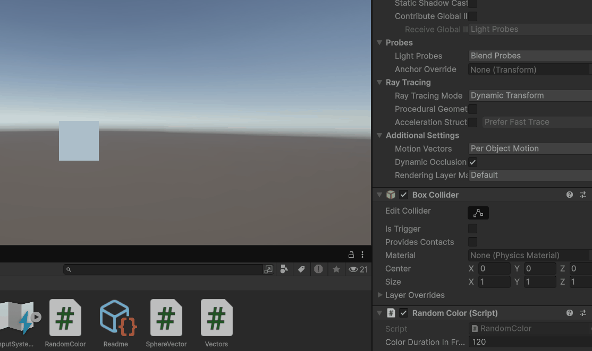
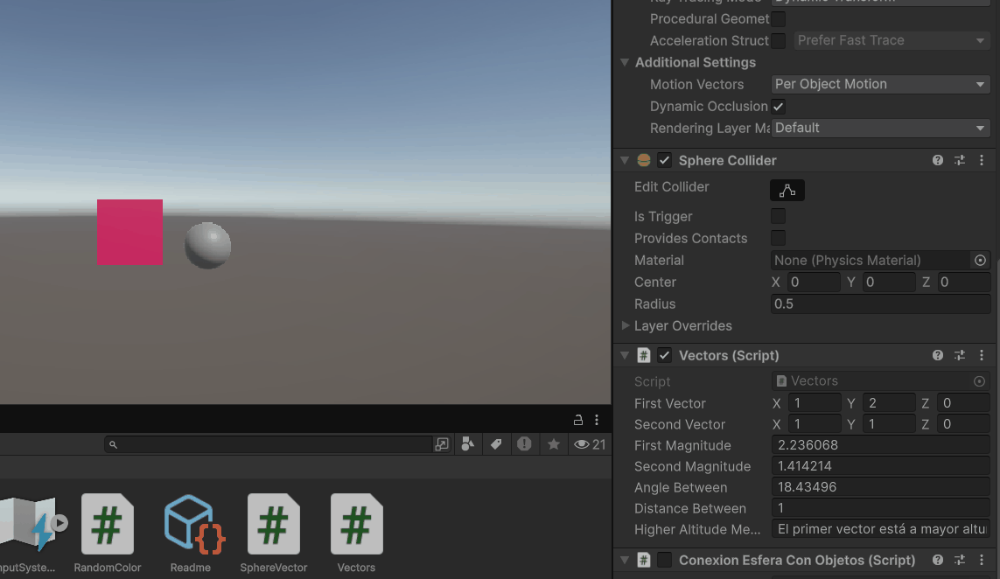
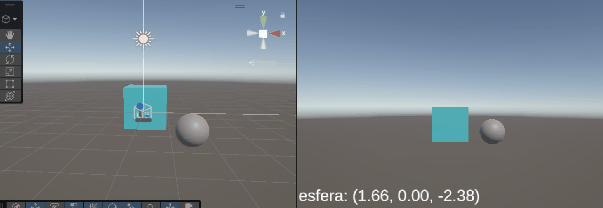
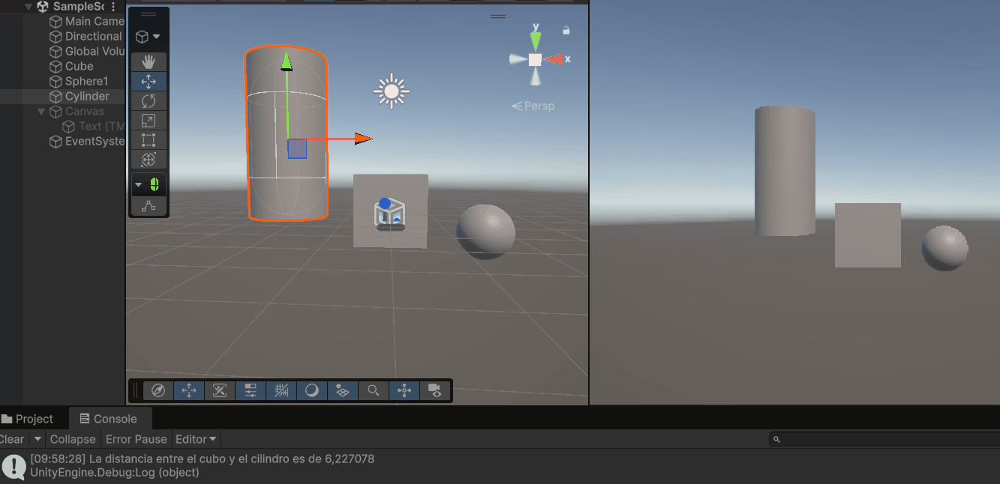

# Práctica 1.1: Movimiento en Unity

Manuel Cadenas García \<[alu0101636849@ull.edu.es](mailto:alu0101636849@ull.edu.es)\>

---
---

### Ejercicio 1: Objeto cambiante de color

El script CambioColor.cs permite darle un color aleatorio a un objeto al inicio y, cada 120 frames, cambiará uno de sus canales de color también aleatoriamente.

Los 120 frames pueden ser cambiados desde el inspector de Unity (atributo público).

Se ha utilizado el método Random.Range() para generar los valores aleatorios de los canales de color.
Se ha utilizado el método GetComponent<Renderer>() para obtener el componente Renderer del objeto y poder cambiar su color.

En la animación se cambia el valor de los frames.

### Ejercicio 2: Características de Vector3

El script CaracteristicasVector3.cs muestra en el inspector las características de dos Vector3: su magnitud, el ángulo entre ellos, la distancia entre ellos y cuál de ellos tiene mayor altura (eje Y).

Se ha utilizado el método Vector3.Magnitude() para obtener la magnitud de los vectores, el método Vector3.Angle() para obtener el ángulo entre ellos y el método Vector3.Distance() para obtener la distancia entre ellos.

### Ejercicio 3: Texto en pantalla

El script TextoPantalla.cs permite mostrar un texto en pantalla mostrando el valor de la posición de la esfera que tenga como tag "esfera_basica".

Se ha utilizado el método GameObject.FindWithTag() para encontrar el objeto con el tag "esfera_basica" y obtener su posición.

Se puso el código en el método Update() para que se actualice la posición de la esfera en tiempo real como se ve en la animación.

### Ejercicio 4: Distancia entre cilindro y cubo

El script DistanciaCilindroCubo.cs permite calcular la distancia entre un cilindro y un cubo, mostrando el resultado en consola.

Se vuelve a utilizar el método GameObject.FindWithTag() para encontrar los objetos con los tags "cilindro_basico" y "cubo_basico" y obtener sus posiciones.

