

# Práctica 1.2: Movimiento en Unity

Manuel Cadenas García \<[alu0101636849@ull.edu.es](mailto:alu0101636849@ull.edu.es)\>

---
---

### Ejercicio 5: Cambio de posición de un objeto 3D

Se han creado tres objetos vacíos que tienen cada uno su propio transform. Además, se han creado tres objetos 3D: una cápsula, un cilindro y una esfera.

Se ha creado un script `Traslacion_ej5.cs` que tiene como variable pública un objeto GameObject llamado `objeto_marcador` donde podemos poner desde el inspector el objeto al que queremos que se mueva el objeto que tiene el script. 

Asignamos el script a cada uno de los objetos 3D y en el inspector asignamos a la variable `objeto_marcador` el objeto vacío correspondiente que tienen de sufijo el nombre identificador de cada objeto 3D.

Características del script:
- La lógica está en `Update()` para que pueda detectar en cada frame si se pulsa la tecla de espacio.
- `Input.GetAxis("Jump")` para detectar cuando se pulsa la tecla de espacio y así mover el objeto 3D a la posición correspondiente.

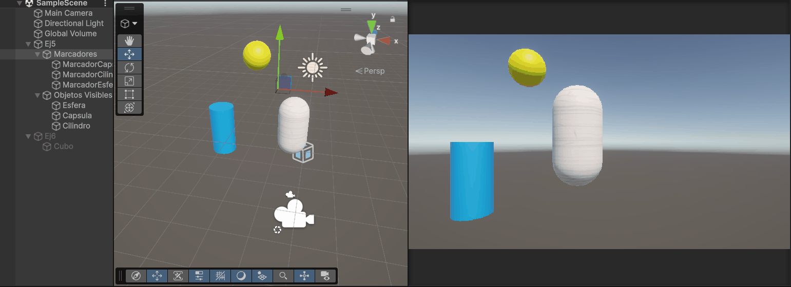

---

### Ejercicio 6: Velocidad con teclas de dirección

Se ha creado un cubo que tiene un script `Velocidad_ej6.cs` que tiene como variable pública un float `velocidad` para poder modificarla desde el inspector. Muestra en consola cuando se pulsa una tecla de dirección y el valor del input multiplicado por la velocidad.

El script tiene su lógica en `Update()` por la misma razón que en el ejercicio anterior.

Al principio se ha utilizado `Input.GetAxis("Horizontal")` y `Input.GetAxis("Vertical")` para detectar cuando se pulsa las teclas de dirección y así mover el cubo en la dirección correspondiente. 

Sin embargo, al utilizar este método `GetAxis()`, el valor del input es un float que va desde -1 a 1, por lo que en consola salen decimales. Por ello, se ha cambiado a `Input.GetAxisRaw("Horizontal")` y `Input.GetAxisRaw("Vertical")` para que el valor del input sea un int que solo puede ser -1, 0 o 1 y así en consola solo salgan enteros. Esto lo leí en la [documentación de Unity](https://docs.unity3d.com/es/530/ScriptReference/Input.GetAxisRaw.html)

Nota: En el gif uso la opción de colapsar la consola para que se vea mejor el movimiento del cubo ya que al pulsar las teclas de dirección se muestran muchos mensajes en consola.

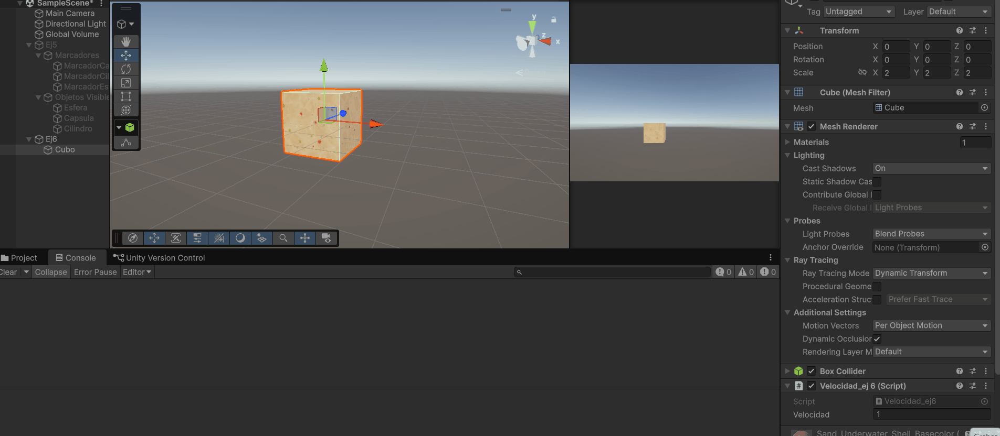

---

### Ejercicio 7: Mapeado de tecla de disparo

Se ha cambiado en el input manager la tecla de disparo (`Fire1`) a la tecla `H` para poder disparar con esa tecla.

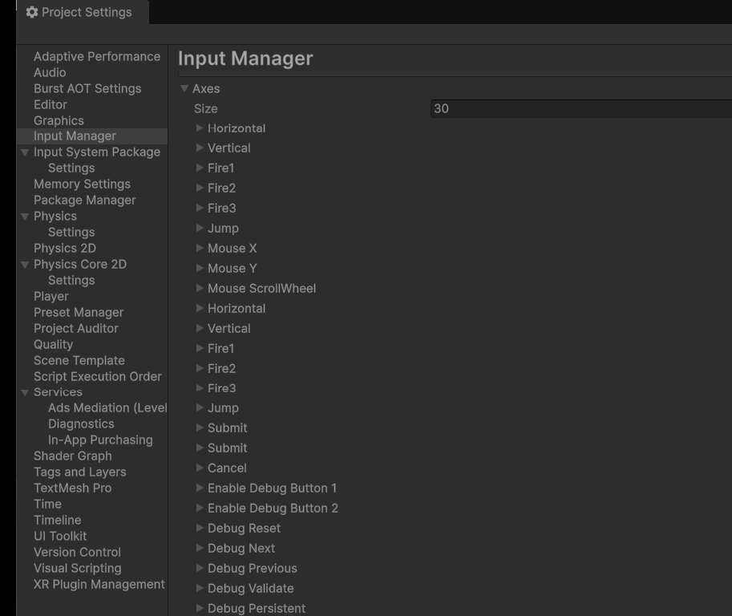

---

### Ejercicio 8: Movimiento con Transform.Translate() con velocidad

Se ha creado un cubo que tiene un script `Movimiento_ej8.cs` que tiene como variables públicas un Vector3 `moveDirection` y un float `speed` para poder modificarlas desde el inspector.

Opcionalmente y como se pide en el ejercicio, se obliga en `Start()` a que la posición del cubo esté en y=0. Se comentó posteriormente para verificar el movimiento cuando el cubo no está en y=0.

Se calcula el movimiento del cubo multiplicando la dirección de movimiento por la velocidad y por `Time.deltaTime`.

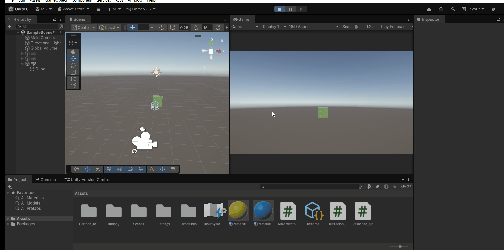

Al duplicar las coordenadas de la dirección de movimiento, el cubo se mueve el doble de rápido.

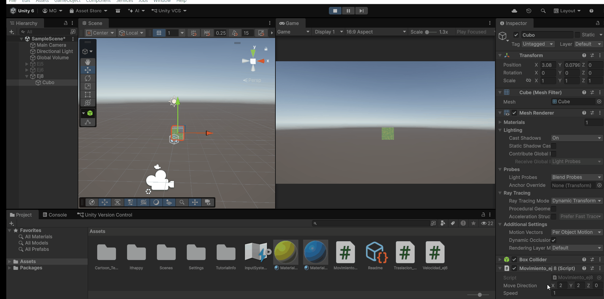

Al duplicar la velocidad, el cubo se mueve el doble de rápido de la misma manera.

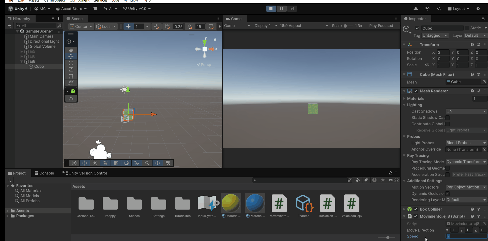

Al cambiar la velocidad a un valor entre 0 y 1, el cubo se mueve más lento que con la velocidad por defecto de 1.
Si llega a ser negativa, el cubo se mueve en la dirección opuesta a la dirección de movimiento.

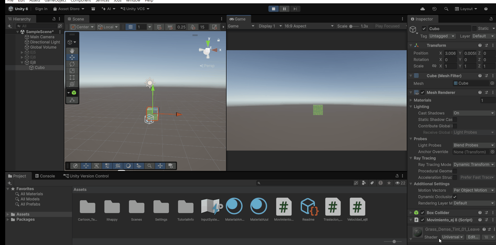

Si se cambia a la posición y > 0, el cubo se mueve en la misma dirección de movimiento pero a una altura mayor. No cambia su comportamiento.

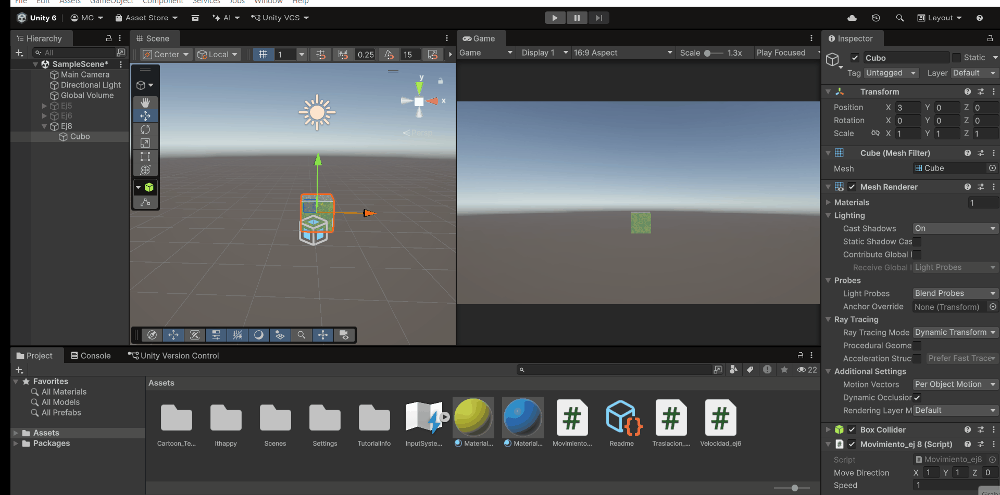

Si se cambia el sistema de coordenadas en el `Transform.Translate()` a `Space.World`, el cubo se mueve en la misma dirección de movimiento pero en el sistema de coordenadas global. No cambia su comportamiento porque no hay ninguna rotación aplicada al cubo.

---

### Ejercicio 9: Movimiento de un cubo con las teclas de dirección

Se ha creado un cubo y una esfera con los scripts `MovimientoCubo_ej9.cs` y `MovimientoEsfera_ej9.cs` respectivamente. Ambos scripts tienen como variables públicas un float `speed` para poder modificarla desde el inspector.

Para el script del cubo, se utiliza `Input.GetKey(KeyCode.RightArrow)`, `Input.GetKey(KeyCode.LeftArrow)`, `Input.GetKey(KeyCode.UpArrow)` y `Input.GetKey(KeyCode.DownArrow)` para detectar cuando se pulsa una tecla de dirección y así mover el cubo en la dirección correspondiente.

Para la esfera, se utiliza la misma función, pero para las teclas `D`, `A`, `W` y `S` para mover la esfera en la dirección correspondiente.

De esta manera se mueven de forma independiente.

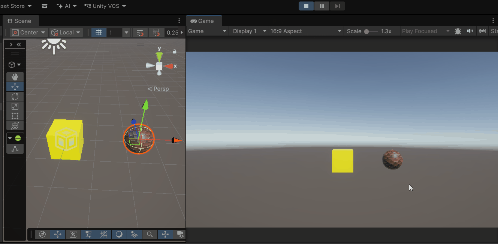

---

### Ejercicio 10: Ejercicio 9 con Time.deltaTime

Se multiplica la dirección de movimiento por la velocidad y ahora por `Time.deltaTime` para que el movimiento del cubo sea independiente de la velocidad de fotogramas.

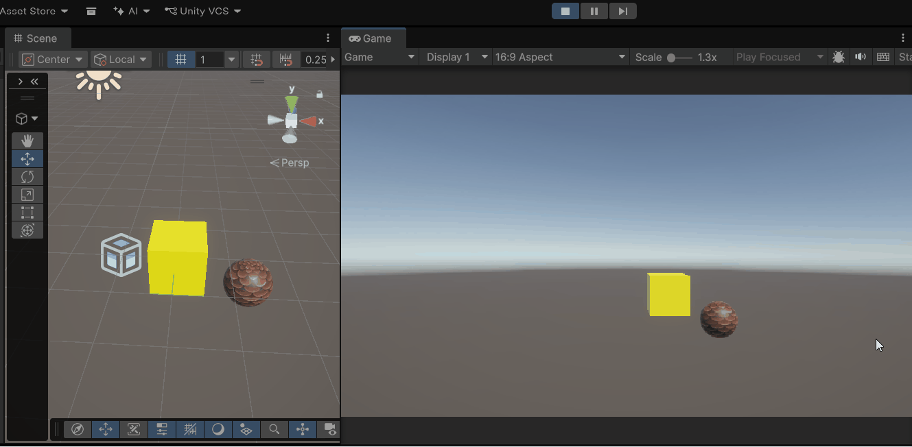

---

### Ejercicio 11: Atracción del cubo a una esfera

Se tiene un cubo con un script `AtraccionEsfera_ej11.cs` que tiene como variables públicas un float `speed`.
Luego tiene un GameObject `esfera` que es la esfera conseguida con `GameObject.Find("EsferaAtrae")` en `Start()`.

La dirección a la que se tiene que mover es la dirección de la esfera menos la posición del cubo y se normaliza con `Vector3.Normalize()`. Luego se multiplica por la velocidad y por `Time.deltaTime` para que el movimiento sea independiente de la velocidad de fotogramas.

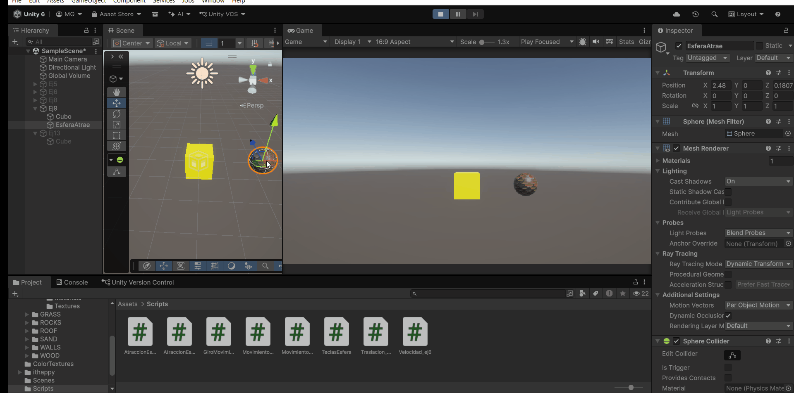

---

### Ejercicio 12: Atracción del cubo a una esfera con rotación del cubo

Aprovechamos los objetos del ejercicio anterior y se le da el script `AtraccionEsfera_ej12.cs` al cubo que tiene como variables públicas un float `speed` de nuevo.

Ahora el punto al que tiene que mirar el cubo (con `transform.LookAt()`) es la posición de la esfera con *y=0*.

Luego la dirección a la que se tiene que mover el cubo es hacia adelante con `transform.forward` multiplicado por la velocidad y por `Time.deltaTime` para que el movimiento sea independiente de la velocidad de fotogramas. Si se quiere hacer así, se tiene que poner en `Space.Self` para que se mueva en el sistema de coordenadas local del cubo, si no, se movería en el sistema de coordenadas global.

Alternativamente, y como se recomienda desde el enunciado, se puede calcular con `transform.forward` la dirección a la que tiene que moverse el cubo y luego usar `Space.World` para que se mueva en el sistema de coordenadas global. Se ha probado ambas formas y funcionan de manera equivalente.

Aparte, la esfera tiene un script `TeclasEsfera.cs` que tiene como variable pública un float `speed` y que utiliza `Input.GetAxis("Horizontal")` y `Input.GetAxis("Vertical")` para detectar cuando se pulsa las teclas de dirección y así mover la esfera por los ejes 'x' y 'z', respectivamente.

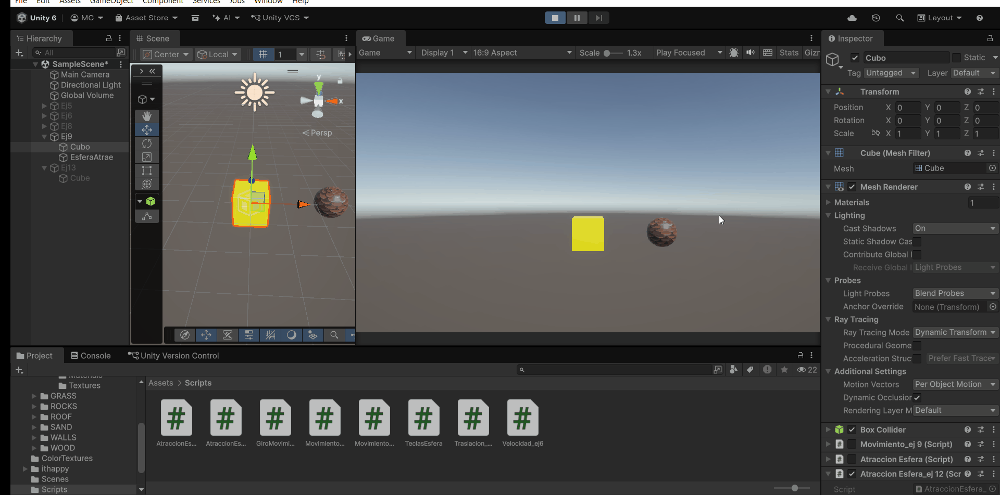

---

### Ejercicio 13: Uso de teclas de dirección para rotar cubo en movimiento perpetuo.

Se tiene un cubo con un script `GiroMovimiento.cs` que tiene como variables públicas un float `speed` para la velocidad a la que irá el cubo.

El script tiene como características:
- Utiliza `Input.GetAxis("Horizontal")` para conseguir la dirección de giro del cubo sobre el eje 'y'.
- Se multiplica la dirección por una velocidad y por `Time.deltaTime` para que el giro sea independiente de la velocidad de fotogramas.
- Luego se usa `Transform.Rotate()` para girar el cubo en la dirección de giro multiplicada por la velocidad.
- Se usa la estrategia del ejercicio anterior para mover el cubo hacia adelante en el sistema de coordenadas local del cubo con `transform.forward`.

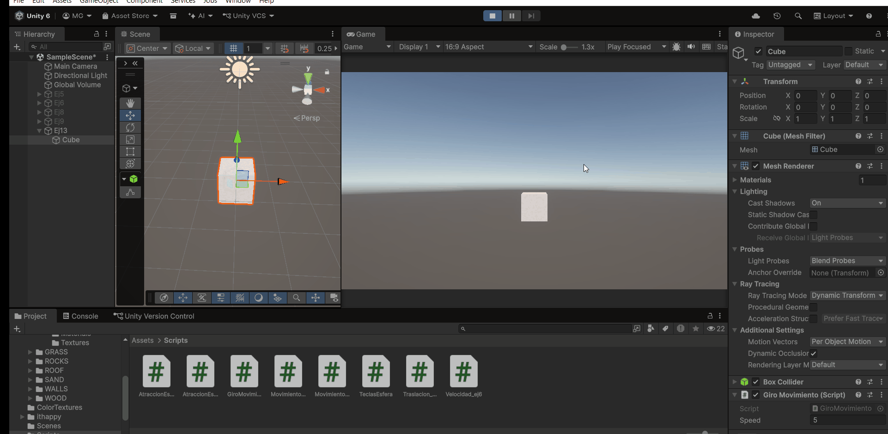
